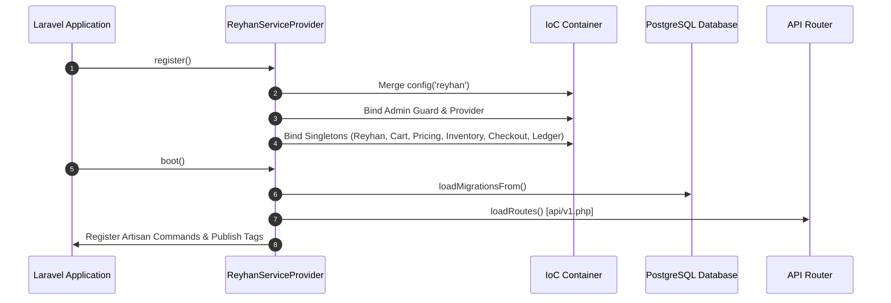

# Reyhan Commerce Core — Framework Architecture Specification

This document details the internal design, lifecycle phases, and domain contracts governing `reyhan-commerce/core`.

---

## 1. Architectural Philosophy

Reyhan Core is engineered to serve as an immutable, headless foundation for mission-critical e-commerce platforms. The framework enforces **Farshid's Laravel Constitution**:

1. **Strict Types Throughout**: Every single file must specify `declare(strict_types=1);`. Dynamic typing is strictly prohibited.
2. **Single-Action Pattern**: All domain mutations and business logic belong in dedicated `final class [Verb][Noun]Action` classes with a single public `execute()` method.
3. **Native Eloquent First**: Zero repositories, zero unnecessary abstraction layers. Relationships, scopes, and query builder methods are first-class citizens.
4. **Modern Model Casts**: Eloquent attributes must be cast using `protected function casts(): array`.
5. **Decoupled Userland**: Userland applications consume the core via Facades, Events, and Service Providers without directly modifying vendor files.

---

## 2. Service Provider & Boot Lifecycle

The package entry point is `Reyhan\Core\ReyhanServiceProvider`:



### Registered Singletons & Facades

- `reyhan`: `Reyhan\Core\Support\Reyhan`
- `reyhan.cart`: `Reyhan\Core\Services\Cart\CartService`
- `reyhan.inventory`: `Reyhan\Core\Services\Inventory\StockReservationService`
- `reyhan.pricing`: `Reyhan\Core\Services\Pricing\PricingService`
- `reyhan.checkout`: `Reyhan\Core\Services\Checkout\CheckoutService`
- `reyhan.ledger`: `Reyhan\Core\Services\Accounting\LedgerService`

---

## 3. Dynamic Model Extensibility Engine

Reyhan uses dynamic class resolution via `Reyhan\Core\Support\Reyhan`. This decouples database relations and business logic from fixed concrete classes.

### Model Aliases
The core registers canonical aliases for all core models:
- `'order'` $\rightarrow$ `Reyhan\Core\Models\Order`
- `'product'` $\rightarrow$ `Reyhan\Core\Models\Product`
- `'variant'` $\rightarrow$ `Reyhan\Core\Models\ProductVariant`
- `'cart'` $\rightarrow$ `Reyhan\Core\Models\Cart`
- `'user'` $\rightarrow$ `Reyhan\Core\Models\User`
- `'category'` $\rightarrow$ `Reyhan\Core\Models\Category`
- `'brand'` $\rightarrow$ `Reyhan\Core\Models\Brand`

### Extension Mechanism
When a consumer overrides a model:
```php
Reyhan::useModel('order', \App\Models\CustomOrder::class);
```
All internal relationships (e.g. `OrderItem->order()`, `Cart->order()`) resolve `Reyhan::orderModel()`, guaranteeing seamless polymorphic inheritance.

---

## 4. High-Concurrency Two-Tier Inventory Guard

Overselling prevention is solved through an asymmetric two-tier concurrency architecture:

```
[Checkout Initiation]
       │
       ▼
┌───────────────────────────────────────────────┐
│ Tier 1: Redis Fast Reservation                │
│ • Atomic DECRBY on variant stock key          │
│ • Temporary 15-minute lock with TTL           │
│ • Returns fast reservation token              │
└──────────────────────┬────────────────────────┘
                       │
             Payment Completed?
              ├── NO  ──► TTL Expires / Lock Released
              └── YES
                       ▼
┌───────────────────────────────────────────────┐
│ Tier 2: PostgreSQL Pessimistic Settlement     │
│ • DB::transaction() boundary                  │
│ • ProductVariant::lockForUpdate()             │
│ • Permanent stock column decrement            │
│ • Release Tier 1 Redis reservation token      │
└───────────────────────────────────────────────┘
```

---

## 5. Double-Entry Accounting Ledger

Any monetary mutation across the framework (wallet balances, refunds, invoice settlements) must record a balanced ledger entry:

$$\sum \text{Debit} \equiv \sum \text{Credit}$$

- Handled by `Reyhan\Core\Services\Accounting\LedgerService`.
- If debit and credit sums fail to match exactly down to the smallest currency subunit, the transaction throws `LedgerImbalanceException` and triggers an immediate rollback.

---

## 6. Commercial Pipelines

Business calculations are processed via customizable pipeline pipelines:
1. **Cart Calculation Pipeline (`Reyhan\Core\Pipelines\Cart\`)**:
   - `ValidateItemsPipe`
   - `ApplyTieredPricingPipe`
   - `ApplyCouponsPipe`
   - `CalculateTaxAndShippingPipe`
2. **Order Creation Pipeline (`Reyhan\Core\Pipelines\Order\`)**:
   - `ValidateStockAvailabilityPipe`
   - `SnapshotCartItemsPipe`
   - `CreateInvoiceRecordsPipe`
   - `DispatchOrderPlacedEventsPipe`

---

## 7. Filament Admin Plugin (`ReyhanCorePlugin`)

Admin capabilities are distributed via Filament v5's plugin interface:
- Resources: `ProductResource`, `OrderResource`, `CategoryResource`, `BrandResource`, `UserResource`, `ReviewResource`.
- Dynamic Settings: `SmsSettings`, `PaymentSettings`, `GeneralSettings`.
- Shield integration: Role-based access control out of the box.
